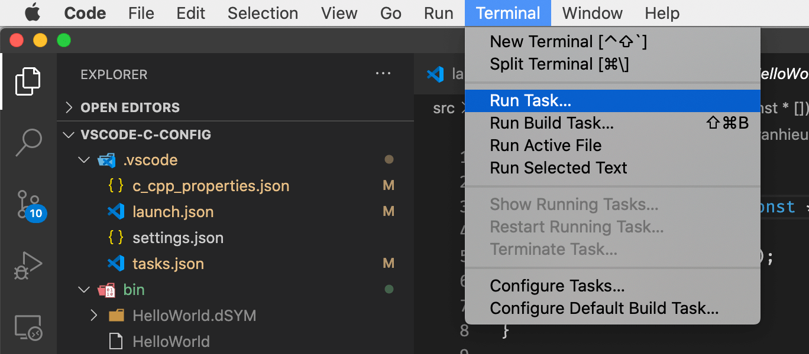
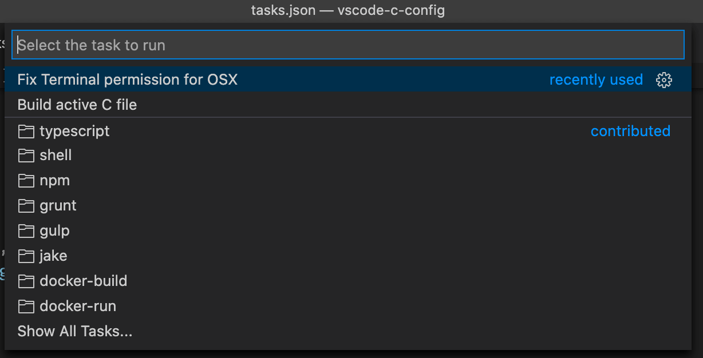
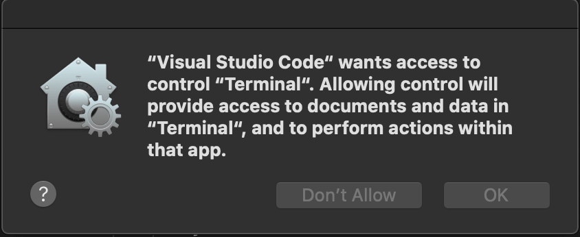
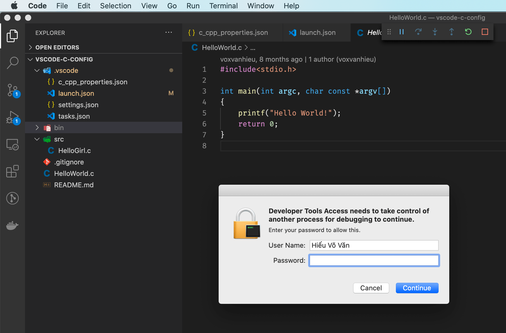
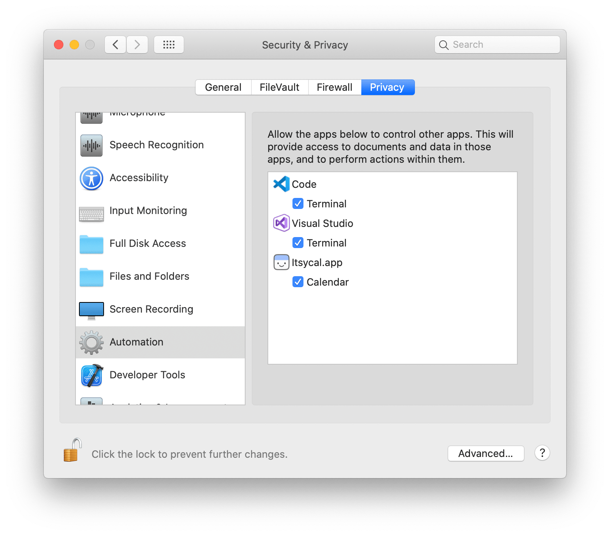

# VSCode config for C/C++

> Working on OSX, Linux & Windows

## How to use

- Install C/C++ compiler.
- Open this workspace in VSCode.
- Create new C file and press F5 to compile and run.
- Compiled execute files are in /bin directory.

## Change compiler to g++ or others

- Open /.vscode/tasks.json

## Fix Terminal permission on OSX

If you run code on MacOS but nothing happends, do the following steps.

